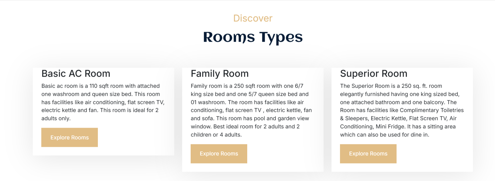

<b>Hotel Reservation System</b>

<b>Room Types</b>

The available room types are listed here. By clicking the "Explore Rooms" button, users can view all the rooms under each specific room type.

<b>User Login and Registration</b>

Users can log in and register through the provided interface. The process allows users to securely access their account and book rooms.

<b>User Dashboard</b>

This is the User Dashboard, where users can view and modify their profile, as well as access their booking history.

<b>Admin Login</b>

For admin access, use the following login details:

<ul>
  <li><b>URL:</b> http://localhost/hotel-reservation-system/admin-login</li>
  <li><b>User ID:</b> admin@example.com</li>
  <li><b>Password:</b> admin@example.com</li>
</ul>

Once logged in, the admin will have access to manage the following sections:

<ul>
  <li>Users Data</li>
  <li>Room Types</li>
  <li>Rooms</li>
  <li>Reservations</li>
</ul>

